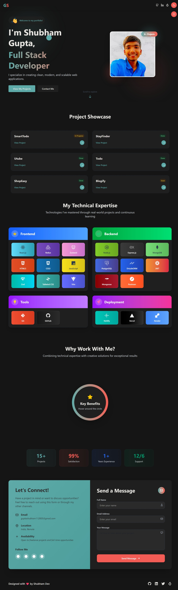

# GuptaShubham-11-Me Portfolio

This is a personal portfolio website built using React, Tailwind CSS 4.0, and Framer Motion for animation. The project features a custom cursor and a dark/light theme toggle.

## Technologies Used
- **React**: A JavaScript library for building user interfaces.
- **Tailwind CSS 4.0**: A utility-first CSS framework for designing responsive layouts.
- **Framer Motion**: A library for adding animations to React components.
- **Custom Cursor**: A custom cursor implementation for a more interactive user experience.

## Screenshot




> Above: A screenshot of the portfolio homepage.

## Directory Structure

```
└── guptashubham-11-me/
    ├── README.md
    ├── eslint.config.js
    ├── index.html
    ├── package.json
    ├── vite.config.js
    ├── .prettierignore
    ├── .prettierrc
    ├── public/
    └── src/
        ├── App.css
        ├── App.jsx
        ├── index.css
        ├── main.jsx
        ├── assets/
        ├── components/
        │   ├── Footer.jsx
        │   ├── Header.jsx
        │   ├── Layout.jsx
        │   ├── ThemeToggle.jsx
        │   └── index.js
        ├── features/
        │   └── themeSlice.js
        └── store/
            └── store.js
```

## Installation

1. Clone the repository:

   ```
   git clone https://github.com/guptashubham-11/guptashubham-11-me.git
   ```

2. Navigate into the project directory:

   ```
   cd guptashubham-11-me
   ```

3. Install the dependencies:

   ```
   npm install
   ```

4. Run the project:

   ```
   npm run dev
   ```

   The app will be running on `http://localhost:3000` by default.

## Features
- **Responsive Design**: The website is fully responsive and adjusts to different screen sizes.
- **Dark/Light Mode Toggle**: Switch between dark and light themes with the theme toggle button.
- **Custom Cursor**: An interactive custom cursor adds a personalized touch to the design.
- **Smooth Animations**: The app uses Framer Motion for smooth animations and transitions.

## Folder Structure

- `public/`: Contains static assets like images and the `index.html` file.
- `src/`: Contains all the source code.
  - `components/`: Includes reusable components like `Header`, `Footer`, `Layout`, and `ThemeToggle`.
  - `features/`: Contains Redux slice files (e.g., `themeSlice.js`).
  - `store/`: Includes the Redux store configuration.

## Contributing

Feel free to fork the repository and submit pull requests. Contributions are welcome!
